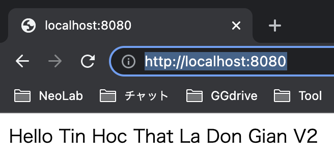
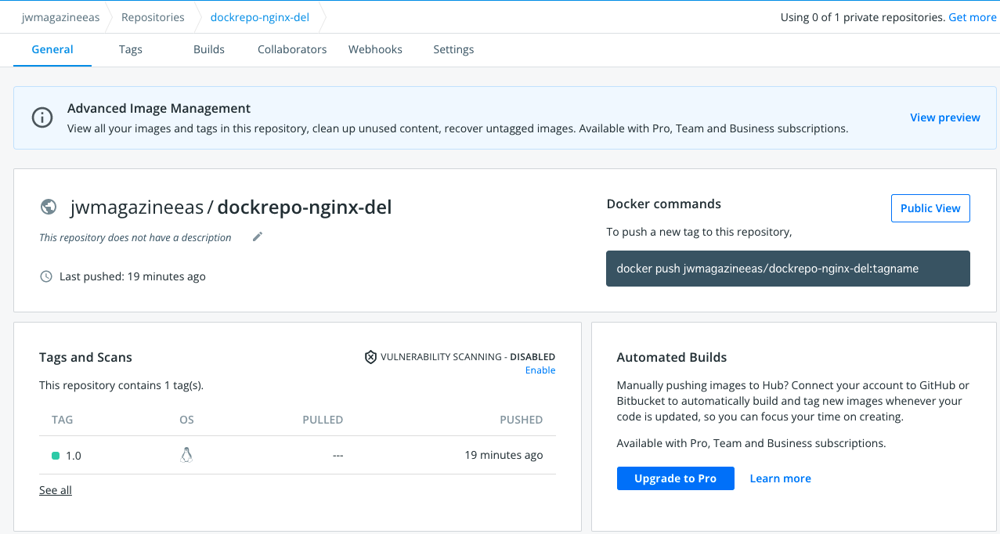
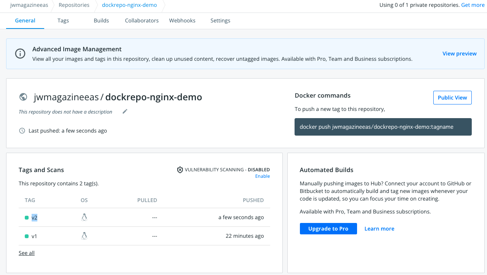
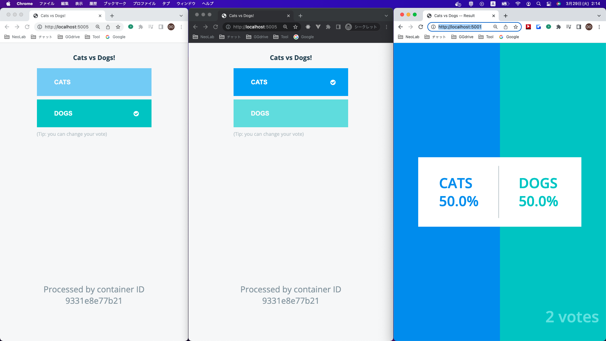
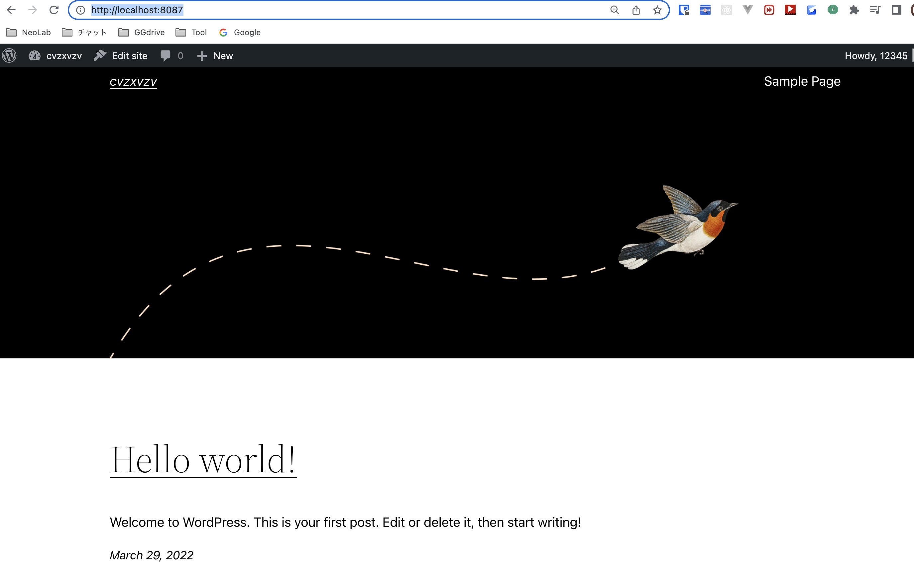
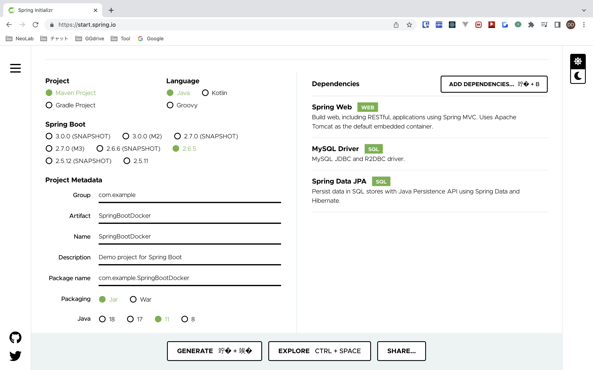
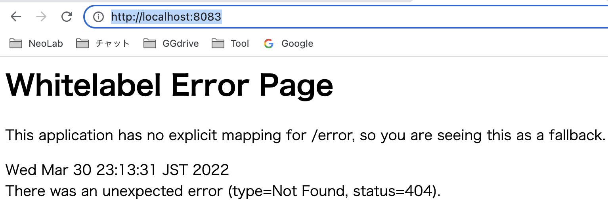
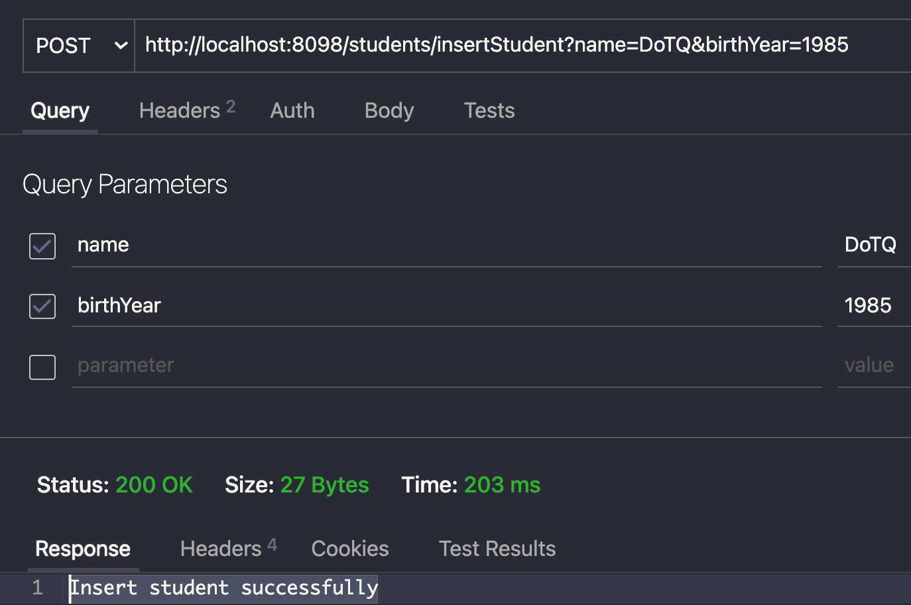
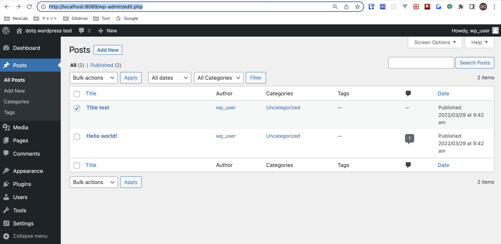
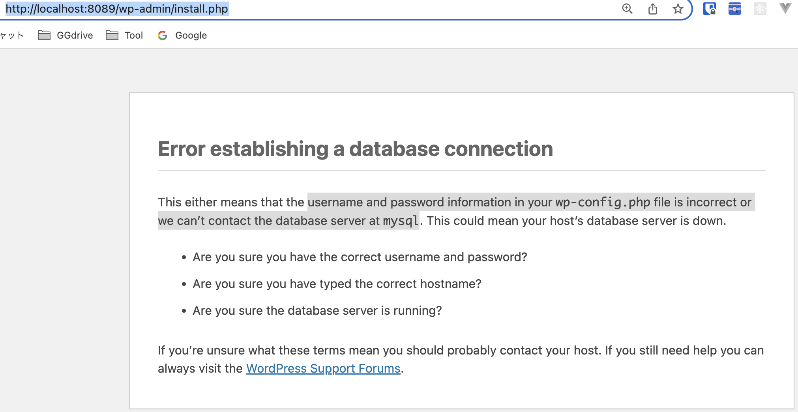

# docker-all-presentation 🐳


[](https://github.com/tquangdo/docker-all-presentation/issues/new)

## definition
1. ### image 
    - đơn vị cơ bản nhất, từ image tạo container
    - các container share chung image. VD 10 containers cùng xài image MySQL thì chỉ pull về 1 image thôi
    - share image trên `hub.docker.com`
1. ### container 
    - ý nghĩa giống 1 instance của máy ảo
    - share resource cho nhau: VD 10 containers cùng xài Linux+MySQL+Nginx thì chỉ chiếm resource cho 1 container chứ ko phải chiếm 10 containers trên bộ nhớ host! 
1. ### volume 
    - ý nghĩa giống S3 hay EFS
    - nếu KO xài volume thì xoá container sẽ mất all data!!! (stop/start OK)

## configure docker env
```shell
docker --version
# Docker version 20.10.17, build 100c701
docker-compose --version
# Docker Compose version v2.10.2
```
> if `docker ps -a` occur ERR `Cannot connect to the Docker daemon at unix:///var/run/docker.sock. Is the docker daemon running?` then:
- wait until occur DLG "need privileged"
- then check:
```shell
ls -lah /var/run/docker.sock /var/tmp/docker.sock
# ls: /var/tmp/docker.sock: No such file or directory
# lrwxr-xr-x  1 root  daemon    43B Sep 19 15:19 /var/run/docker.sock -> /Users/do.tranquang/.docker/run/docker.sock
```

## reference
[tinhocthatladongian](https://www.youtube.com/watch?v=q3Vhi_MvUsQ&list=PLjCpH2Qpki-sTjdlYXE8AifSKQFa8ZL23&index=27)

## overall
1. ### run other image in docker hub
    1. #### by run/container run official image
        - `docker run --name cont-mysql -e MYSQL_ROOT_PASSWORD=123456 -p 3306:3306 -d mysql` => connect OK by Workbench
        - `docker run --name cont-apache -p 8081:80 -d httpd` => connect OK by `localhost:8081` on browser
        ```shell
        docker exec -it da517a963ef1 bash
        cat /usr/local/apache2/htdocs/index.html
        => 
        <html><body><h1>It works!</h1></body></html>
        ```
    1. #### by run privileged hub's image
        - run privileged
        ```shell
        docker run --privileged -d -p 8080:80 tinhocthatladongian/project01 
        =>
        Unable to find image 'tinhocthatladongian/project01:latest' locally
        docker: Error response from daemon: manifest for tinhocthatladongian/project01:latest not found: manifest unknown: manifest unknown.
        ```
        - search `tinhocthatladongian/project01` on `hub.docker.com` -> latest tags=`v2`
        ```shell
        docker run --privileged -d -p 8080:80 tinhocthatladongian/project01:v2 # NOT missing of "-p 8080:80" 
        docker ps
        =>
        CONTAINER ID   IMAGE                              COMMAND        CREATED          STATUS          PORTS                  NAMES
        7104e869d2cf   tinhocthatladongian/project01:v2   "/sbin/init"   37 seconds ago   Up 36 seconds   0.0.0.0:8080->80/tcp   tender_jones
        ```
        - access `localhost:8080` on browser
        
        > if NOT have `privileged` will ERR on browser
        ```shell
        docker exec -it <container_id> bash
        systemctl status httpd
        =>
        Failed to get D-Bus connection: Operation not permitted
        ```
    1. #### edit HTML
        - edit container
        ```shell
        docker exec -it 7104e869d2cf bash
        systemctl status httpd # active (running)
        cat /var/www/html/index.html 
        # <html><body>Hello Tin Hoc That La Don Gian V3</body></html>
        ```
        - access `localhost:8080` on browser -> "Hello Tin Hoc That La Don Gian V3"

        > if ERR "Failed to get D-Bus connection"
        - `nano ~/Library/Group\ Containers/group.com.docker/settings.json`: change `deprecatedCgroupv1` = false->true
        ```shell
        cat ~/Library/Group\ Containers/group.com.docker/settings.json | grep deprecatedCgroupv1 # "deprecatedCgroupv1": true,
        ```
1. ### login docker hub
    - already login
    ```shell
    cat ~/.docker/config.json | grep docker.io # "https://index.docker.io/v1/": {},
    ```
    - login after logout
    ```shell
    docker login
    =>
    ...
    Username: jwmagazineeas
    Password: 
    Login Succeeded
    ```    
    > need to install "jq": `brew install jq`
    - check username
    ```shell
    docker-credential-$(
    jq -r .credsStore ~/.docker/config.json
    ) list | jq -r '
    . |
        to_entries[] |
        select(
        .key | 
        contains("docker.io")
        ) |
        last(.value)
    '
    => jwmagazineeas
    ```
    - check more credential infos
    ```shell
    docker-credential-desktop list | \
    jq -r 'to_entries[].key'   | \
    while read; do
        docker-credential-desktop get <<<"$REPLY";
    done
    ```
    ```json
    {"ServerURL":"https://388576098417.dkr.ecr.us-west-2.amazonaws.com","Username":"AWS","Secret":"..."}
    {"ServerURL":"https://462123133781.dkr.ecr.ap-northeast-1.amazonaws.com","Username":"AWS","Secret":"..."}
    {"ServerURL":"https://462123133781.dkr.ecr.us-east-1.amazonaws.com","Username":"AWS","Secret":"..."}
    {"ServerURL":"https://index.docker.io/v1/","Username":"jwmagazineeas","Secret":"..."}
    {"ServerURL":"https://registry.heroku.com","Username":"_","Secret":"..."}
    ```
1. ### pull & push in docker hub
    1. #### src code
        - `overall/Dockerfile` & `overall/index.html`
    1. #### local
        ```shell
        overall$ docker build -t img-nginx-demo:v1 .
        docker images # will see "img-nginx-demo > v1"
        docker run -d --name cont-nginx-demo -p 8080:80 img-nginx-demo:v1
        docker ps # will see "cont-nginx-demo"
        ```
        > change tag(image) name
        > `docker build -t img-nginx-demo .`
        > `docker tag img-nginx-demo:latest img-nginx-demo:v1`
        > `docker rmi img-nginx-demo:latest`
        - access `localhost:8080` on browser -> "DTQ!!!"
    1. #### push docker hub
        1. ##### commit
            ```shell
            docker ps
            =>
            CONTAINER ID   IMAGE          COMMAND                  CREATED       STATUS       PORTS                  NAMES
            0509bea79b68   f5ed82203f09   "/docker-entrypoint.…"   3 hours ago   Up 3 hours   0.0.0.0:8080->80/tcp   cont-nginx-demo
            docker images
            =>
            REPOSITORY                          TAG       IMAGE ID       CREATED          SIZE
            jwmagazineeas/dockrepo-nginx-del    1.0       27fe34b66905   21 seconds ago   142MB
            docker commit -m "test docker commit CMD" -a "DoTQ" 0509bea79b68 jwmagazineeas/dockrepo-nginx-del:1.0
            > check comment & author by: `docker inspect 27fe34b66905 | grep -E 'Author|Comment'`
            ```
        1. ##### NO need to create new repo in docker hub
            ```shell
            # if NOT exist image yet:
            # docker build -t jwmagazineeas/dockrepo-nginx-del:1.0 .
            docker push jwmagazineeas/dockrepo-nginx-del:1.0
            ```
            - will auto create repo `dockrepo-nginx-del` in docker hub
            
            - delete containers & images
    1. #### pull docker hub
        ```shell
        docker pull jwmagazineeas/dockrepo-nginx-demo:v1
        docker images
        =>
        REPOSITORY                          TAG       IMAGE ID       CREATED          SIZE
        jwmagazineeas/dockrepo-nginx-demo   v1        262b11cf5916   14 minutes ago   142MB
        docker run -d --name cont-nginx-demo -p 8080:80 262b11cf5916
        docker ps # will see "cont-nginx-demo"
        ```
        - access `localhost:8080` on browser -> "DTQ!!!"
    1. #### push v2 docker hub
        - change `overall/index.html: DTQ V2!!!`
        ```shell
        docker build -t img-nginx-demo:v2 .
        docker images # will see "img-nginx-demo > v2"
        ```
        - test local before pushing
        ```shell
        docker run -d --name cont-nginx-demo -p 8080:80 img-nginx-demo:v2
        docker ps # will see "cont-nginx-demo"
        ```
        - access `localhost:8080` on browser -> "DTQ v2!!!"
        - push
        ```shell
        docker tag img-nginx-demo:v2 jwmagazineeas/dockrepo-nginx-demo:v2
        docker push jwmagazineeas/dockrepo-nginx-demo:v2
        ```
        
        - delete containers & images

## docker-compose
1. ### vote app reference
    [example-voting-app](https://github.com/dockersamples/example-voting-app)
    - change code FROM port `5000` TO `5005` (because macOS use default `5000` for other purpose)
    ```shell
    docker-compose up --build
    =>
    ...
    Creating example-voting-app_redis_1 ... done
    Creating example-voting-app_db_1    ... done
    Creating example-voting-app_vote_1   ... done
    Creating example-voting-app_worker_1 ... done
    Creating example-voting-app_result_1 ... done
    ```
    - access `localhost:5005` for voting & `localhost:5001` for result
    
1. ### apache
    - src code in folder `docker-compose/php`
    - ⚠️⚠️⚠️ IMPORTANT ⚠️⚠️⚠️: due to `yum -y install httpd` in `Dockerfile`, MUST use port=`80` in `docker-compose.yml`, otherwise will ERR "Failed to get D-Bus connection"
    ```yml
    ports:
        - "8089:80"
    ```
1. ### wordpress
    1. #### deploy
        - src code in folder `docker-compose/wordpress`
        ```shell
        docker-compose up -d --build
        docker volume ls
        =>
        DRIVER    VOLUME NAME
        local     wordpress_vol_db_data
        docker network ls
        =>
        NETWORK ID     NAME                          DRIVER    SCOPE
        db05f6fc483c   wordpress_nw_dotq_wordpress   bridge    local
        docker ps
        =>
        CONTAINER ID   IMAGE       COMMAND                  CREATED          STATUS          PORTS                  NAMES
        2c5a0f8a9d8f   wordpress   "docker-entrypoint.s…"   20 seconds ago   Up 19 seconds   0.0.0.0:8087->80/tcp   cont_wordpress
        7c53b97e42fd   mysql       "docker-entrypoint.s…"   21 seconds ago   Up 20 seconds   3306/tcp, 33060/tcp    cont_mysql
        ```
    1. #### result
        - access `localhost:8087` on browser
        
        - access MySQL
        ```shell
        docker exec -it cont_mysql mysql -u root -p
        Enter password: 
        ...
        mysql> show databases;
        +--------------------+
        | Database           |
        +--------------------+
        | information_schema |
        | mysql              |
        | performance_schema |
        | sys                |
        | wp_db              |
        +--------------------+
        5 rows in set (0.00 sec)
        mysql> use wp_db;
        Database changed
        mysql> show tables;
        Empty set (0.00 sec)
        ```
1. ### flask
    1. ### reference
        [hoangnd](https://www.youtube.com/watch?v=x5UIe7quicQ&list=PLWBrqglnjNl3TDF6WKpAl4maE3yJ5CpYF&index=12)
    1. #### check environment
        ```shell
        pip3 freeze | grep Flask
        => Flask==2.0.2
        ```
        - copy "Flask==2.0.2" into `docker-compose/py-flask/requirements.txt`
        ```shell
        pip3 install mysql-connector-python
        pip3 freeze | grep mysql-connector-python
        => mysql-connector-python==8.0.28
        ```
        - copy into `docker-compose/py-flask/requirements.txt`
    1. #### local (initial)
        1. ##### src code
            - only `docker-compose/py-flask/app.py` & `docker-compose/py-flask/requirements.txt`
            ```py
            @app.route('/')
            def hello_world():
                return 'Hello World !!!'
            ```
        1. ##### deploy
            ```shell
            python3 -m flask run
            * Environment: production
            ...
            * Running on http://127.0.0.1:5000/ (Press CTRL+C to quit)
            127.0.0.1 - - [30/Mar/2022 19:50:20] "GET / HTTP/1.1" 200 -
            ```
        1. ##### result
            - access `localhost:5000` on browser => will see "Hello World !!!"
    1. #### docker-compose
        1. ##### deploy
            - src code: all in repo
        1. ##### deploy
            ```shell
            py-flask$ docker-compose up --build 
            ```
        1. ##### result
            - access `localhost:5002/products` on browser => will ERR "Internal Server Error"
            - in logs will see: "cont-py-flask  | mysql.connector.errors.ProgrammingError: 1049 (42000): Unknown database 'ProductManagement'"
            - access `localhost:5002/initdb` => will see "init Database"
            - access `localhost:5002/init_tables` => will see "init_tables"
            - access `localhost:5002/products` again => will see "[]"
            ```shell
            docker exec -it cont-mysql mysql -u root -p
            Enter password: 
            ...
            mysql> show databases;
            +--------------------+
            | Database           |
            +--------------------+
            | ProductManagement  |
            | information_schema |
            | mysql              |
            | performance_schema |
            | sys                |
            +--------------------+
            5 rows in set (0.00 sec)
            mysql> use ProductManagement
            Database changed
            mysql> show tables;
            +-----------------------------+
            | Tables_in_ProductManagement |
            +-----------------------------+
            | tblProduct                  |
            +-----------------------------+
            1 row in set (0.00 sec)
            mysql> select * from tblProduct;
            Empty set (0.00 sec)
            ```
            - insert records into `tblProduct`
            ```sql
            INSERT INTO tblProduct(name, description) VALUES
                -> ('macboook pro m1', 'please buy'),
                -> ('iphone 13', 'please buy and buy');
            Query OK, 2 rows affected (0.02 sec)
            Records: 2  Duplicates: 0  Warnings: 0

            mysql> select * from tblProduct;
            +----+-----------------+--------------------+
            | id | name            | description        |
            +----+-----------------+--------------------+
            |  1 | macboook pro m1 | please buy         |
            |  2 | iphone 13       | please buy and buy |
            +----+-----------------+--------------------+
            2 rows in set (0.00 sec)
            ```
            - access `localhost:5002/products` again
            ```json
            [
                {
                    id: 1,
                    name: "macboook pro m1",
                    description: "please buy"
                },
                {
                    id: 2,
                    name: "iphone 13",
                    description: "please buy and buy"
                }
            ]
            ```
1. ### springboot
    1. #### initial (local)
        1. ##### src code
            - folder `docker-compose/SpringBootDocker`
            
            - `docker-compose/SpringBootDocker/pom.xml` cmt out `spring-boot-starter-data-jpa` & `mysql-connector-java`
            - `docker-compose/SpringBootDocker/src/main/resources/application.properties` add `server.port=8083`
        1. ##### deploy
            ```shell
            SpringBootDocker$ ./mvnw spring-boot:run
            =>
            ...
            2022-03-30 23:13:17.990  INFO 70883 --- [main] o.s.b.w.embedded.tomcat.TomcatWebServer  : Tomcat started on port(s): 8083 (http) with context path ''
            ```
        1. ##### result
            - access `localhost:8083` on browser
            
    1. #### GET API (local)
        1. ##### src code
            - `docker-compose/SpringBootDocker/src/main/java/com/example/SpringBootDocker/controllers/StudentController.java`:
            ```java
            @RestController
            @RequestMapping(path = "students")
            public class StudentController {
                // http://localhost:8083/students/hello
                @RequestMapping(value = "/hello", method = RequestMethod.GET)
                public String hello(ModelMap modelMap) {
                    return "Hello World!!!";
                }
            }
            ```
        1. ##### deploy
            ```shell
            SpringBootDocker$ ./mvnw spring-boot:run # need to stop > rerun to reflect
            ```
        1. ##### result
            - access `localhost:8083/students/hello` on browser => "Hello World!!!"
    1. #### docker-compose
        1. ##### deploy
            - src code: all in repo
        1. ##### deploy
            ```shell
            SpringBootDocker$ docker-compose up --build 
            ```
        1. ##### result
            - check MySQL
            ```shell
            docker exec -it cont-mysql mysql -u root -p
            Enter password: 
            mysql> show databases;
            +--------------------+
            | Database           |
            +--------------------+
            | StudentManagement  |
            | information_schema |
            | mysql              |
            | performance_schema |
            | sys                |
            +--------------------+
            5 rows in set (0.01 sec)
            mysql> use StudentManagement;
            Database changed
            mysql> show tables;
            +-----------------------------+
            | Tables_in_StudentManagement |
            +-----------------------------+
            | tblStudent                  |
            +-----------------------------+
            1 row in set (0.01 sec)
            mysql> select * from tblStudent;
            Empty set (0.00 sec)
            mysql> desc tblStudent;
            +-----------+--------------+------+-----+---------+----------------+
            | Field     | Type         | Null | Key | Default | Extra          |
            +-----------+--------------+------+-----+---------+----------------+
            | id        | int          | NO   | PRI | NULL    | auto_increment |
            | birthYear | int          | YES  |     | NULL    |                |
            | name      | varchar(255) | YES  |     | NULL    |                |
            +-----------+--------------+------+-----+---------+----------------+
            3 rows in set (0.01 sec)
            ```
            - access `localhost:8098/students/showAllStudents` on browser
            ```json
            []
            ```
            - POST API `localhost:8098/students/insertStudent`
            ---
            
            - access `localhost:8098/students/showAllStudents` again
            ```json
            [
                {
                    id: 1,
                    name: "DoTQ",
                    birthYear: 1985
                }
            ]
            ```

## volume & NW
1. ### volume
    1. #### create & run container from volume
        - create volume
        ```shell
        docker volume create vol-hello
        docker volume inspect vol-hello
        =>
        [
            {
                "CreatedAt": "2022-03-29T03:17:06Z",
                "Driver": "local",
                "Labels": {},
                "Mountpoint": "/var/lib/docker/volumes/vol-hello/_data", # in macos: "~/Library/Containers/com.docker.docker/Data/vms/0"
                "Name": "vol-hello",
                "Options": {},
                "Scope": "local"
            }
        ]
        ```
        - access to volume in macos
        ```shell
        docker run -it --privileged --pid=host debian nsenter -t 1 -m -u -n -i sh
        @ echo "DoTQ!!!" > /var/lib/docker/volumes/vol-hello/_data/index.html
        docker images
        =>
        REPOSITORY   TAG       IMAGE ID       CREATED       SIZE
        debian       latest    d69c6cd3a20d   3 hours ago   124MB
        docker ps -a
        =>
        CONTAINER ID   IMAGE     COMMAND                  CREATED              STATUS                      PORTS                  NAMES
        df1483ad42a5   debian    "nsenter -t 1 -m -u …"   6 minutes ago        Exited (0) 18 seconds ago                          silly_mcnulty
        ```
        - create & run container: `docker run --name cont-hello -p 8081:80 -v vol-hello:/usr/local/apache2/htdocs -d httpd`
        - access `localhost:8081` on browser => see "DoTQ!!!"
        - delete containers & images
        - check volume
         ```shell
        docker volume ls
        =>
        DRIVER    VOLUME NAME
        local     vol-hello
        ```
        - create & run container again > access `localhost:8081` on browser => see "DoTQ!!!"
    1. #### xoá container sẽ mất all data!!! (stop/start OK)
        - create container
        ```shell
        docker run --name cont-mysql -e MYSQL_ROOT_PASSWORD=123456 -p 3306:3306 -d mysql
        docker ps
        =>
        CONTAINER ID   IMAGE     COMMAND                  CREATED         STATUS         PORTS                               NAMES
        02f44cbc9f7d   mysql     "docker-entrypoint.s…"   8 minutes ago   Up 2 seconds   0.0.0.0:3306->3306/tcp, 33060/tcp   cont-mysql
        ```
        - delete container & create again => lose all data!!!
        - add volume: `docker run --name cont-mysql -v <vol-name!!!>:/var/lib/mysql -e MYSQL_ROOT_PASSWORD=123456 -p 3306:3306 -d mysql`
1. ### NW
    1. #### theory
        - list: default=`bridge`
        ```shell
        docker network ls
        =>
        NETWORK ID     NAME      DRIVER    SCOPE
        76539fb188bb   bridge    bridge    local
        68f186ebc286   host      host      local
        46d403aa3fbc   none      null      local
        ```
        - inspect `bridge`
        ```shell
        docker network inspect bridge
        =>
        ...
        "Name": "cont-apache",
        "EndpointID": "xxx",
        "MacAddress": "02:42:ac:11:00:02",
        "IPv4Address": "172.17.0.2/16",
        ```
        > different from host IP
        ```shell
        ifconfig | grep "inet " | grep -v 127.0.0.1 | cut -d\  -f2
        => 192.168.0.5
        ```
        - inspect `host`: `docker network inspect host | grep IPv4Address` => blank!
        > ubuntu: `hostname -i | awk '{print $3}'`
        > debian: `hostname -i`
    1. #### hands-on
        - exercise 1: busybox
        ```shell
        docker network create --subnet 192.168.1.0/24 nw-dotq-test
        docker network ls
        =>
        NETWORK ID     NAME           DRIVER    SCOPE
        b846fc14b4bf   nw-dotq-test   bridge    local
        docker run -itd --name=cont-1(2) --network nw-dotq-test busybox
        docker network inspect nw-dotq-test
        =>
        ...
        "Containers": {
            "xxx": {
                "Name": "cont-1",
                ...
                "IPv4Address": "192.168.1.2/24",
                "IPv6Address": ""
            },
            "yyy": {
                "Name": "cont-2",
                ...
                "IPv4Address": "192.168.1.3/24",
                "IPv6Address": ""
            }
        },
        docker attach cont-1 # just only for "busybox"
        @ ping 192.168.1.3
        PING 192.168.1.3 (192.168.1.3): 56 data bytes
        64 bytes from 192.168.1.3: seq=0 ttl=64 time=0.317 ms
        ^C
        --- 192.168.1.3 ping statistics ---
        6 packets transmitted, 6 packets received, 0% packet loss
        ```
        - exercise 2: wordpress
        ```shell
        docker run --hostname=sv_db --name cont-mysql --network nw-dotq-test -e MYSQL_DATABASE=wp_db -e MYSQL_USER=wp_user -e MYSQL_PASSWORD=123456 -e MYSQL_ROOT_PASSWORD=123456 -d mysql
        docker run --name cont-wordpress --network nw-dotq-test -e WORDPRESS_DB_HOST=sv_db -e WORDPRESS_DB_NAME=wp_db -e WORDPRESS_DB_USER=wp_user -e WORDPRESS_DB_PASSWORD=123456 -p 8089:80 -d wordpress
        docker ps
        =>
        CONTAINER ID   IMAGE       COMMAND                  CREATED         STATUS         PORTS                  NAMES
        45fde987c9a5   wordpress   "docker-entrypoint.s…"   4 seconds ago   Up 2 seconds   0.0.0.0:8089->80/tcp   cont-wordpress
        867f50425b9d   mysql       "docker-entrypoint.s…"   2 minutes ago   Up 2 minutes   3306/tcp, 33060/tcp    cont-mysql
        ```
        - access `localhost:8089` on browser
        
    1. #### troubleshooting
        - access `localhost:8089` on browser: ERR "Error establishing a database connection"!!! (without `--hostname=sv_db`)
        
        - debug NW:
        1. docker network inspect nw-dotq-test => "cont-wordpress"=`192.168.1.3/24` & "cont-mysql"=`192.168.1.2/24`
        2. docker exec -it 45fde987c9a5 bash
        3. hostname -i => 192.168.1.3
        4. install ping: apt update && apt install iputils-ping
        5. ping 192.168.1.2 => OK
        6. check the same with: `docker exec -it 867f50425b9d bash`
        - debug wordpress container:
        1.
        ```shell
        docker logs -f cont-wordpress | grep -E 'error|ERROR'
        =>
        WordPress not found in /var/www/html - copying now...
        Complete! WordPress has been successfully copied to /var/www/html
        No 'wp-config.php' found in /var/www/html, but 'WORDPRESS_...' variables supplied; copying 'wp-config-docker.php' (WORDPRESS_DB_PASSWORD)
        AH00558: apache2: Could not reliably determine the server's fully qualified domain name, using 192.168.1.3. Set the 'ServerName' directive globally to suppress this message
        AH00558: apache2: Could not reliably determine the server's fully qualified domain name, using 192.168.1.3. Set the 'ServerName' directive globally to suppress this message
        [Tue Mar 29 05:51:26.937027 2022] [mpm_prefork:notice] [pid 1] AH00163: Apache/2.4.52 (Debian) PHP/7.4.28 configured -- resuming normal operations
        [Tue Mar 29 05:51:26.937187 2022] [core:notice] [pid 1] AH00094: Command line: 'apache2 -D FOREGROUND'
        ```
        2. 
        ```shell
        cont-wordpress@ service apache2 status
        =>
        apache2 is running.
        cont-wordpress@ cat /var/www/html/wp-config.php
        =>
        /** The name of the database for WordPress */
        define( 'DB_NAME', getenv_docker('WORDPRESS_DB_NAME', 'wordpress') );

        /** Database username */
        define( 'DB_USER', getenv_docker('WORDPRESS_DB_USER', 'example username') );

        /** Database password */
        define( 'DB_PASSWORD', getenv_docker('WORDPRESS_DB_PASSWORD', 'example password') );

        /** Database hostname */
        define( 'DB_HOST', getenv_docker('WORDPRESS_DB_HOST', 'mysql') );
        ```

## note
 ```shell
docker rm -f $(docker ps -a -q) && docker rmi -f $(docker images -a -q) && docker volume rm $(docker volume ls)
```

