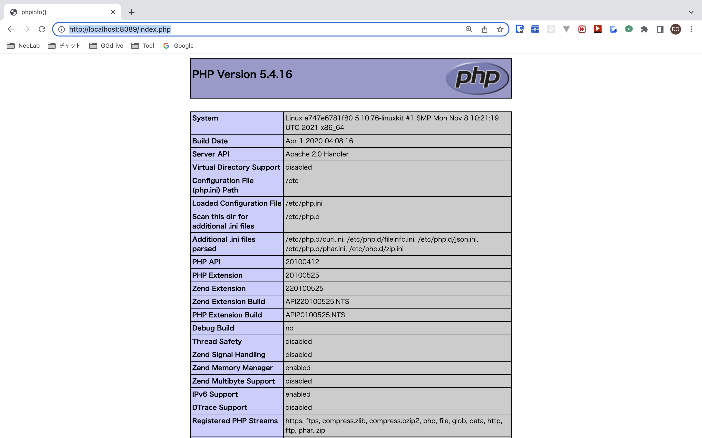

# docker-all-presentation 🐳


[](https://github.com/tquangdo/docker-all-presentation/issues/new)

## reference
[tinhocthatladongian](https://www.youtube.com/watch?v=q3Vhi_MvUsQ&list=PLjCpH2Qpki-sTjdlYXE8AifSKQFa8ZL23&index=27)

## definition
1. ### image 
    - đơn vị cơ bản nhất, từ image tạo container
    - share image trên `hub.docker.com`
1. ### container 
    - ý nghĩa giống 1 instance của máy ảo
    - share resource cho nhau: VD 10 containers cùng xài Linux+MySQL+Nginx thì 3 resource này chỉ chiếm 1 lần chứ ko phải chiếm 10 lần trên bộ nhớ host! 
1. ### container 
    - ý nghĩa giống S3 hay EFS
    - nếu KO xài volume thì xoá container sẽ mất all data!!! (stop/start OK)

## overall
1. ### run other image in docker hub
    1. #### by run/container run (OK)
        - `docker container run --name cont-mysql -e MYSQL_ROOT_PASSWORD=123456 -p 3306:3306 -d mysql` => connect OK by Workbench
        - `docker run --name cont-apache -p 8081:80 -d httpd` => connect OK by `localhost:8081`
        ```shell
        docker exec -it da517a963ef1 bash
        cat /usr/local/apache2/htdocs/index.html
        => 
        <html><body><h1>It works!</h1></body></html>
        ```
    1. #### by run privileged (OK)
        - run privileged
        ```shell
        docker run --privileged -d -p 8080:80 tinhocthatladongian/project01  /sbin/init 
        =>
        Unable to find image 'tinhocthatladongian/project01:latest' locally
        docker: Error response from daemon: manifest for tinhocthatladongian/project01:latest not found: manifest unknown: manifest unknown.
        ```
        - search `tinhocthatladongian/project01` on `hub.docker.com` -> latest tags=`v2`
        ```shell
        docker run --privileged -d -p 8080:80 tinhocthatladongian/project01:v2  /sbin/init 
        docker ps
        =>
        CONTAINER ID   IMAGE                              COMMAND        CREATED          STATUS          PORTS                  NAMES
        7104e869d2cf   tinhocthatladongian/project01:v2   "/sbin/init"   37 seconds ago   Up 36 seconds   0.0.0.0:8080->80/tcp   tender_jones
        ```
    1. #### by pull (NG!!!)
        ```shell
        docker pull tinhocthatladongian/project01:v2
        docker images => GET image_id (Ex: `d4198267234f`)
        docker run -d --name cont-nginx-demo -p 8080:80 d4198267234f
        docker exec -it <container_id> bash
        systemctl status httpd
        =>
        Failed to get D-Bus connection: Operation not permitted
        ```
    1. #### edit HTML
        - access `localhost:8080` on browser
        
        - edit container
        ```shell
        docker exec -it 7104e869d2cf bash
        systemctl status httpd # active (running)
        cat /var/www/html/index.html 
        # <html><body>Hello Tin Hoc That La Don Gian V3</body></html>
        ```
        - access `localhost:8080` on browser -> "Hello Tin Hoc That La Don Gian V3"

        > if ERR "Failed to get D-Bus connection"
        - `nano ~/Library/Group\ Containers/group.com.docker/settings.json`: change `deprecatedCgroupv1` = false->true
        ```shell
        cat ~/Library/Group\ Containers/group.com.docker/settings.json | grep deprecatedCgroupv1 # "deprecatedCgroupv1": true,
        ```
1. ### login docker hub
    - already login
    ```shell
    cat ~/.docker/config.json | grep docker.io # "https://index.docker.io/v1/": {},
    ```
    - login after logout
    ```shell
    docker login
    =>
    ...
    Username: jwmagazineeas
    Password: 
    Login Succeeded
    ```    
    > need to install "jq": `brew install jq`
    - check username
    ```shell
    docker-credential-$(
    jq -r .credsStore ~/.docker/config.json
    ) list | jq -r '
    . |
        to_entries[] |
        select(
        .key | 
        contains("docker.io")
        ) |
        last(.value)
    '
    => jwmagazineeas
    ```
    - check more credential infos
    ```shell
    docker-credential-desktop list | \
    jq -r 'to_entries[].key'   | \
    while read; do
        docker-credential-desktop get <<<"$REPLY";
    done
    ```
    ```json
    {"ServerURL":"https://388576098417.dkr.ecr.us-west-2.amazonaws.com","Username":"AWS","Secret":"..."}
    {"ServerURL":"https://462123133781.dkr.ecr.ap-northeast-1.amazonaws.com","Username":"AWS","Secret":"..."}
    {"ServerURL":"https://462123133781.dkr.ecr.us-east-1.amazonaws.com","Username":"AWS","Secret":"..."}
    {"ServerURL":"https://index.docker.io/v1/","Username":"jwmagazineeas","Secret":"..."}
    {"ServerURL":"https://registry.heroku.com","Username":"_","Secret":"..."}
    ```
1. ### pull & push in docker hub
    1. #### src code
        - `overall/Dockerfile` & `overall/index.html`
    1. #### local
        ```shell
        overall$ docker build -t img-nginx-demo:v1 .
        docker images # will see "img-nginx-demo > v1"
        docker run -d --name cont-nginx-demo -p 8080:80 img-nginx-demo:v1
        docker ps # will see "cont-nginx-demo"
        ```
        - access `localhost:8080` on browser -> "DTQ!!!"
    1. #### push docker hub
        1. ##### create new repo in docker hub
            - create repo `dockrepo-nginx-demo` in docker hub
            ```shell
            docker tag img-nginx-demo:v1 jwmagazineeas/dockrepo-nginx-demo:v1
            docker push jwmagazineeas/dockrepo-nginx-demo:v1
            ```
            
        1. ##### NO need to create new repo in docker hub
            ```shell
            docker ps
            =>
            CONTAINER ID   IMAGE          COMMAND                  CREATED       STATUS       PORTS                  NAMES
            0509bea79b68   f5ed82203f09   "/docker-entrypoint.…"   3 hours ago   Up 3 hours   0.0.0.0:8080->80/tcp   cont-nginx-demo
            docker images
            =>
            REPOSITORY                          TAG       IMAGE ID       CREATED          SIZE
            jwmagazineeas/dockrepo-nginx-del    1.0       27fe34b66905   21 seconds ago   142MB
            docker commit -m "test docker commit CMD" -a "DoTQ" 0509bea79b68 jwmagazineeas/dockrepo-nginx-del:1.0
            > check comment & author by: `docker inspect 27fe34b66905 | grep -E 'Author|Comment'`
            docker push jwmagazineeas/dockrepo-nginx-del:1.0
            ```
            - will auto create repo `dockrepo-nginx-del` in docker hub
            
            - delete containers & images
    1. #### pull docker hub
        ```shell
        docker pull jwmagazineeas/dockrepo-nginx-demo:v1
        docker images
        =>
        REPOSITORY                          TAG       IMAGE ID       CREATED          SIZE
        jwmagazineeas/dockrepo-nginx-demo   v1        262b11cf5916   14 minutes ago   142MB
        docker run -d --name cont-nginx-demo -p 8080:80 262b11cf5916
        docker ps # will see "cont-nginx-demo"
        ```
        - access `localhost:8080` on browser -> "DTQ!!!"
    1. #### push v2 docker hub
        - change `overall/index.html: DTQ V2!!!`
        ```shell
        docker build -t img-nginx-demo:v2 .
        docker images # will see "img-nginx-demo > v2"
        ```
        - test local before pushing
        ```shell
        docker run -d --name cont-nginx-demo -p 8080:80 img-nginx-demo:v2
        docker ps # will see "cont-nginx-demo"
        ```
        - access `localhost:8080` on browser -> "DTQ v2!!!"
        - push
        ```shell
        docker tag img-nginx-demo:v2 jwmagazineeas/dockrepo-nginx-demo:v2
        docker push jwmagazineeas/dockrepo-nginx-demo:v2
        ```
        
        - delete containers & images

## docker-compose
1. ### reference
    [example-voting-app](https://github.com/dockersamples/example-voting-app)
    - change code FROM port `5000` TO `5005` (because macOS use default `5000` for other purpose)
    ```shell
    docker-compose up --build
    =>
    ...
    Creating example-voting-app_redis_1 ... done
    Creating example-voting-app_db_1    ... done
    Creating example-voting-app_vote_1   ... done
    Creating example-voting-app_worker_1 ... done
    Creating example-voting-app_result_1 ... done
    ```
    - access `localhost:5005` for voting & `localhost:5001` for result
    
1. ### src code
    - `docker-compose/docker-compose.yml` & `docker-compose/Dockerfile`
    - ⚠️⚠️⚠️ IMPORTANT ⚠️⚠️⚠️: due to httpd, MUST expose port=`80` in `Dockerfile`, otherwise will ERR "Failed to get D-Bus connection"
1. ### run
    - access `localhost:8089/index.php` on browser
    

## volume & NW
1. ### volume
    1. #### create & run container from volume
        - create volume
        ```shell
        docker volume create vol-hello
        docker volume inspect vol-hello
        =>
        [
            {
                "CreatedAt": "2022-03-29T03:17:06Z",
                "Driver": "local",
                "Labels": {},
                "Mountpoint": "/var/lib/docker/volumes/vol-hello/_data", # in macos: "~/Library/Containers/com.docker.docker/Data/vms/0"
                "Name": "vol-hello",
                "Options": {},
                "Scope": "local"
            }
        ]
        ```
        - access to volume in macos
        ```shell
        docker run -it --privileged --pid=host debian nsenter -t 1 -m -u -n -i sh
        @ echo "DoTQ!!!" > /var/lib/docker/volumes/vol-hello/_data/index.html
        docker images
        =>
        REPOSITORY   TAG       IMAGE ID       CREATED       SIZE
        debian       latest    d69c6cd3a20d   3 hours ago   124MB
        docker ps -a
        =>
        CONTAINER ID   IMAGE     COMMAND                  CREATED              STATUS                      PORTS                  NAMES
        df1483ad42a5   debian    "nsenter -t 1 -m -u …"   6 minutes ago        Exited (0) 18 seconds ago                          silly_mcnulty
        ```
        - create & run container: `docker run --name cont-hello -p 8081:80 -v vol-hello:/usr/local/apache2/htdocs -d httpd`
        - access `localhost:8081` on browser => see "DoTQ!!!"
        - delete containers & images
        - check volume
         ```shell
        docker volume ls
        =>
        DRIVER    VOLUME NAME
        local     vol-hello
        ```
        - create & run container again > access `localhost:8081` on browser => see "DoTQ!!!"
    1. #### xoá container sẽ mất all data!!! (stop/start OK)
        - create container
        ```shell
        docker container run --name cont-mysql -e MYSQL_ROOT_PASSWORD=123456 -p 3306:3306 -d mysql
        docker ps
        =>
        CONTAINER ID   IMAGE     COMMAND                  CREATED         STATUS         PORTS                               NAMES
        02f44cbc9f7d   mysql     "docker-entrypoint.s…"   8 minutes ago   Up 2 seconds   0.0.0.0:3306->3306/tcp, 33060/tcp   cont-mysql
        ```
        - delete container & create again => lose all data!!!
        - add volume: `docker container run --name cont-mysql -v <vol-name!!!>:/var/lib/mysql -e MYSQL_ROOT_PASSWORD=123456 -p 3306:3306 -d mysql`
1. ### NW
    - list: default=`bridge`
    ```shell
    docker network ls
    =>
    NETWORK ID     NAME      DRIVER    SCOPE
    76539fb188bb   bridge    bridge    local
    68f186ebc286   host      host      local
    46d403aa3fbc   none      null      local
    ```
    - inspect `bridge`
    ```shell
    docker network inspect bridge
    =>
    ...
    "Name": "cont-apache",
    "EndpointID": "xxx",
    "MacAddress": "02:42:ac:11:00:02",
    "IPv4Address": "172.17.0.2/16",
    ```
    > different from host IP
    ```shell
    ifconfig | grep "inet " | grep -v 127.0.0.1 | cut -d\  -f2
    => 192.168.0.5
    ```

    - inspect `host`: `docker network inspect host | grep IPv4Address` => blank!

## note
 ```shell
docker rm -f $(docker ps -a -q) && docker rmi -f $(docker images -a -q) && docker volume rm $(docker volume ls)
```
